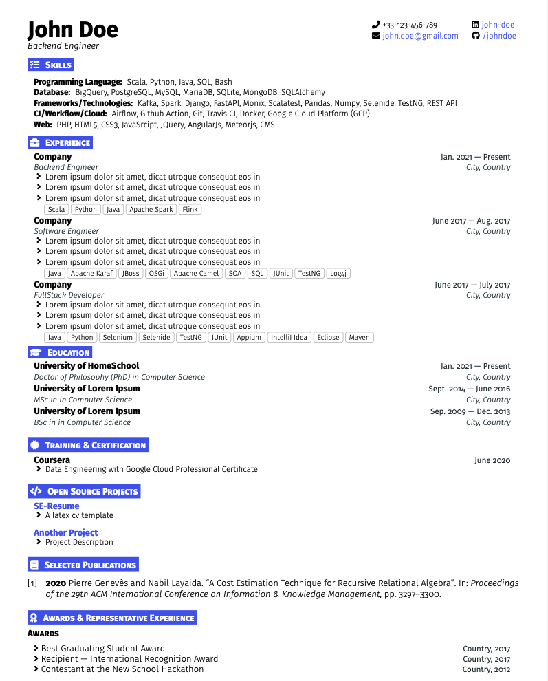

# SE-Resume Template

This is a clean and elegant Latex CV template.

## Usage

### se-resume.cls

The template style is defined in the ```se-resume.cls``` class. Use this style by adding it to your document class as follows;

```Latex
\documentclass{se-resume}

% set header

\begin{document}
    % document body
\end{document}
```

### Set header values

```Latex
\name{John Doe}
\subtitle{Backend Engineer}
\setphone{+33-123-456-789}
\setemail{john.doe@gmail.com}
\setlinkedin{john-doe}
\setgithub{johndoe}
```

### Section

```Latex
\section{<icon>}{Text}
```

```<icon>``` is fontawesome5 icon

### cvblock

```Latex
\begin{cvblock}
  % everything comes inside this block
\end{cvblock}
```

### entryheader

The entry header is particularly useful for the experience section where the company name, date, position and city can be specified.

```Latex
\entryhead{Company}{Date}{Position}{City, Country}
```

### simpleheader

A simple header with two parameters, on the left and right side respectively

```Latex
\simpleheader{Title}{Date}
```

### cventrylist

A list is defined in a ```cventrylist``` entry block

```Latex
\begin{cventrylist}
    \entryitem{Item 1}
    \entryitem{Item 2}
    \entryitem{Item 3}
\end{cventrylist}
```

### itemdetailed

A detailed list with item on both can be defined using ```itemdetailed```

```Latex
\itemdetailed{Some Long text}{Short text}
```

### skillsentry

Skills are defined with the ```skillsentry``` command.

```Latex
\skillsentry{Languages} {Scala, Python, Java, SQL, Bash}
```

### tagline

This can be used to display tech stack below each experience entry for example.

```Latex
\tagline{Scala, Python, Java, Apache Spark, Flink}
```

## Preview

This template is filled with dummy text, feel free to edit and use.



You can preview the generated [pdf here](#preview)

## Credits

- This template is based on the works of [Leslie Cheng](https://github.com/lcfyi) and [sb2nov](https://github.com/sb2nov/resume).

- This template uses FontAwesome Icons.
